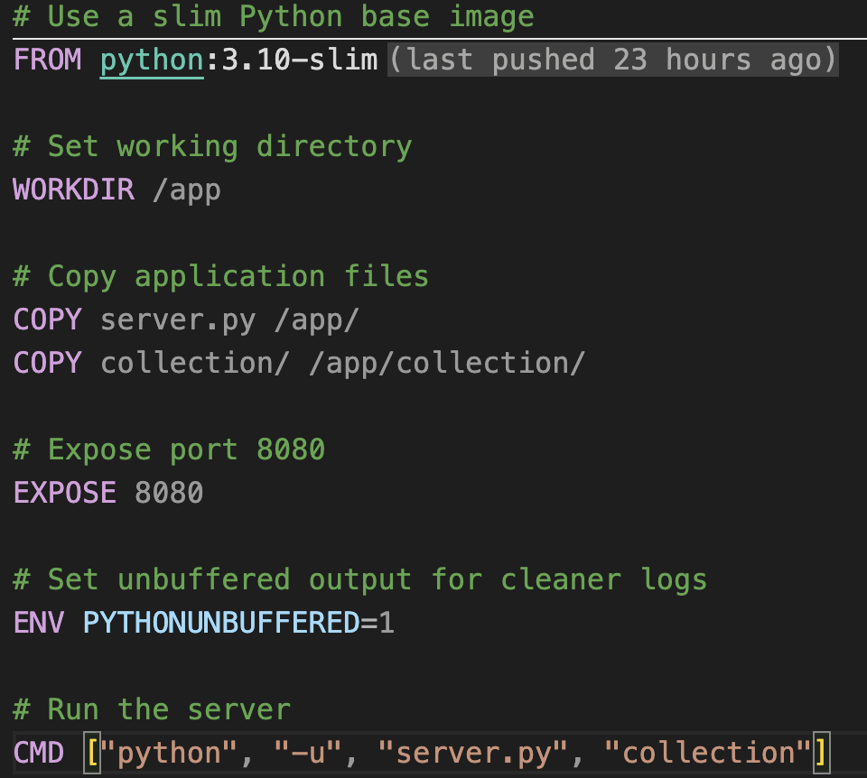
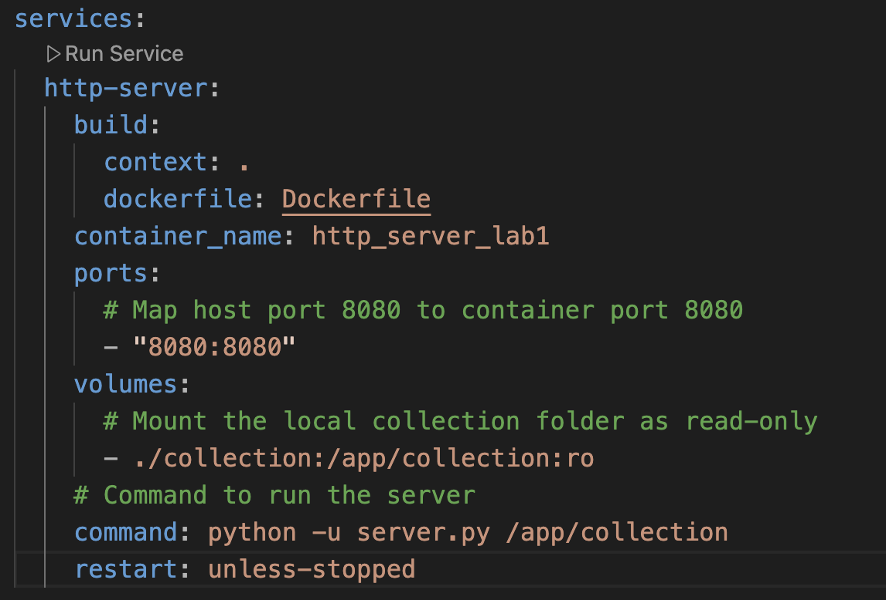

# Laboratory Work #1: HTTP File Server with TCP Sockets

**Student:** Bulat Cristian  
**Group:** FAF-232  
**Course:** Network Programming (PR)  
**Laboratory:** Lab 1 - HTTP File Server Implementation  
**Academic Year:** 2025  
Faculty of Computers, Informatics and Microelectronics  
Technical University of Moldova (UTM)

---

## Table of Contents

1. [Introduction](#introduction)
2. [Project Structure](#project-structure)
3. [Docker Setup](#docker-setup)
4. [Served Directory Contents](#served-directory-contents)
5. [Testing File Requests (Browser)](#testing-file-requests-browser)
6. [HTTP Client Implementation & Testing](#http-client-implementation--testing-bonus-2-points)
7. [Directory Listing Feature](#directory-listing-feature-bonus-2-points)
8. [Network Browsing](#network-browsing-bonus-1-point)
9. [Requirements Verification Summary](#requirements-verification-summary)
10. [How to Run](#how-to-run)
11. [Conclusion](#conclusion)

---

## Introduction

This report details the implementation of a basic HTTP file server using Python's TCP socket programming capabilities, fulfilling the requirements for Laboratory Work #1. The server supports serving different file types (HTML, PNG, PDF), handles errors, generates directory listings for nested directories, and is deployed using Docker Compose. A corresponding HTTP client was also developed for testing purposes. All core and bonus requirements have been met.

### Requirements Completed:

- ✅ HTTP server with TCP sockets
- ✅ Support for HTML, PNG, and PDF files
- ✅ 404 error handling
- ✅ Docker Compose deployment
- ✅ **[BONUS +2 pts]** HTTP client implementation
- ✅ **[BONUS +2 pts]** Directory listing with nested directories
- ✅ **[BONUS +1 pt]** Network browsing capability (demonstrated using VPS)

**Total Score: 10/10 points**

---

## Project Structure


*The project structure showing source files (`server.py`, `client.py`), Docker configuration (`Dockerfile`, `docker-compose.yml`), the `collection` directory, `downloads` and `vps_downloads` directories, and the `REPORT.md` file.*

---

## Docker Setup

### Dockerfile



*The Dockerfile uses `python:3.10-slim`, copies files, exposes port 8080, and sets the CMD.*

**Dockerfile content snippet:**

```dockerfile
# Use a slim Python base image
FROM python:3.10-slim

# Set working directory
WORKDIR /app

# Copy application files
COPY server.py /app/
COPY collection/ /app/collection/

# Expose port 8080
EXPOSE 8080

# Set unbuffered output for cleaner logs
ENV PYTHONUNBUFFERED=1

# Run the server
CMD ["python", "-u", "server.py", "collection"]
```

### docker-compose.yml



*Docker Compose configuration defining the service, ports, and volumes.*

**docker-compose.yml content snippet:**

```yaml
services:
  http-server:
    build:
      context: .
      dockerfile: Dockerfile
    container_name: http_server_lab1
    ports:
      # Map host port 8080 to container port 8080
      - "8080:8080"
    volumes:
      # Mount the local collection folder as read-only
      - ./collection:/app/collection:ro
    # Command to run the server
    command: python -u server.py /app/collection
    restart: unless-stopped
```

### Building the Docker Image

**Command:**
```bash
docker-compose build
```


*Terminal output showing the successful build process.*

### Starting the Server

**Command:**
```bash
docker-compose up -d
```


*Terminal output showing the container starting.*

### Verifying Container Status

**Command:**
```bash
docker ps
```


*Output confirming the container is running and port 8080 is mapped.*

### Checking Server Logs

**Command:**
```bash
docker-compose logs -f
```


*Initial server logs indicating successful startup.*

---

## Served Directory Contents


*The `collection` directory contains `index.html`, `Dog.png`, and a `Books` subdirectory with PDF files.*

---

## Testing File Requests (Browser)

### Test 1: HTML File with Embedded Image

**Browser URL:** `http://localhost:8080/`


*Browser rendering `index.html` with the embedded `Dog.png` visible.*

### Test 2: PNG Image File

**Browser URL:** `http://localhost:8080/Dog.png`


*Browser displaying `Dog.png` directly.*

### Test 3: PDF Document

**Browser URL:** `http://localhost:8080/Books/Chapter_1.pdf`


*Browser displaying `Chapter_1.pdf` using its PDF viewer.*

### Test 4: 404 Error (Nonexistent File)

**Browser URL:** `http://localhost:8080/nonexistent-page.xyz`


*Browser displaying the custom 404 error page.*

---

## HTTP Client Implementation & Testing (BONUS +2 points)

The `client.py` script implements an HTTP client for testing.

### Client Test: HTML Output

**Command:**
```bash
python client.py localhost 8080 / ./downloads
```


*Client terminal printing the HTML source of `index.html`.*

### Client Test: PNG Download

**Command:**
```bash
python client.py localhost 8080 /Dog.png ./downloads
```


*Client terminal showing successful download of `Dog.png`.*

### Client Test: PDF Download

**Command:**
```bash
python client.py localhost 8080 /Books/Chapter_2.pdf ./downloads
```


*Client terminal showing successful download of `Chapter_2.pdf`.*

### Downloaded Files Verification


*The `downloads` directory showing the files downloaded by the client.*

**Result:** ✅ Client successfully downloads binary files and displays HTML.

---

## Directory Listing Feature (BONUS +2 points)

The server generates directory listings.

### Directory Listing (Browser - Books/)

**Browser URL:** `http://localhost:8080/Books/`


*Browser showing the styled listing for `/Books/` with parent link and PDF files.*

### Directory Listing (Client Output - Books/)

**Command:**
```bash
python client.py localhost 8080 /Books/ ./downloads
```


*Client terminal printing the HTML source for the `/Books/` directory listing.*

**Result:** ✅ Server generates functional listings for nested directories.

---

## Network Browsing (BONUS +1 point)

Tested by deploying the server to a VPS (`40.160.15.47`) and accessing via the local client.

### Downloading from VPS Server (Client Terminal)

**Command (run locally):**
```bash
python client.py 40.160.15.47 8080 /Dog.png ./vps_downloads
```


*Local client successfully connecting to the VPS and downloading `Dog.png`.*

### Verifying Connection on VPS (Server Logs)

**Command (run on VPS):**
```bash
docker-compose logs -f http-server
```


*Server logs on the VPS confirming the connection and successful file serving.*

### Downloaded VPS File Verification


*Local `vps_downloads` directory showing the file downloaded from the VPS.*

**Result:** ✅ Server is network-accessible and client connects remotely.

---

## Requirements Verification Summary

### Core Requirements ✅

- ✅ **HTTP file server using TCP sockets:** Implemented in `server.py`
- ✅ **Parse HTTP requests:** Handles `GET` method and path
- ✅ **Read requested file:** Serves files from the specified directory
- ✅ **Create HTTP response with headers:** Sends valid HTTP/1.1 responses
- ✅ **404 Not Found:** Implemented custom error page
- ✅ **Support HTML, PNG, PDF:** Correct MIME types are used
- ✅ **Directory as CLI argument:** Server accepts directory path
- ✅ **Content with HTML, PNG, PDFs:** `collection` directory populated
- ✅ **HTML references PNG:** `index.html` includes `` tag
- ✅ **Docker Compose:** Project fully containerized

### Bonus Requirements ✅

- ✅ **HTTP Client (+2 pts):** Implemented in `client.py`
  - Takes required arguments
  - Displays HTML in terminal
  - Saves PNG/PDF files
- ✅ **Directory Listing (+2 pts):** Implemented in `server.py`
  - Generates HTML with hyperlinks
  - Supports nested directories
- ✅ **Browse Friend's Server (+1 pt):** Demonstrated using VPS
  - Server accessible over network
  - Client connects to remote IP

**Total Points: 10/10** ✅

---

## How to Run

### Using Docker (Recommended)

```bash
# Build and start the server in the background
docker-compose up --build -d

# View server logs (Press Ctrl+C to stop viewing)
docker-compose logs -f

# Stop and remove the container
docker-compose down
```

Access in browser: `http://localhost:8080`

### Using Python Directly

```bash
# Terminal 1: Run server
# Make sure you are in the Lab1 directory
python server.py collection

# Terminal 2: Run client
python client.py localhost 8080 /index.html ./downloads
python client.py localhost 8080 /Dog.png ./downloads
python client.py localhost 8080 /Books/Chapter_1.pdf ./downloads
```

---

## Conclusion

This laboratory work successfully implements a complete HTTP file server using TCP sockets in Python, meeting all core and bonus requirements as outlined in the course materials. The server correctly handles requests for HTML, PNG, and PDF files, provides 404 error pages, and generates dynamic directory listings for nested structures. The accompanying HTTP client effectively tests these features. Deployment via Docker Compose ensures reproducibility. Network accessibility was confirmed using a VPS.

**Key Learnings:** Low-level socket programming, HTTP protocol implementation, file I/O, directory listing generation, basic security, and containerization with Docker.

---
