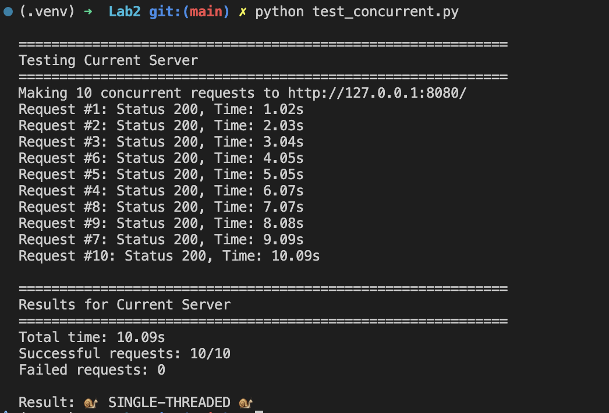
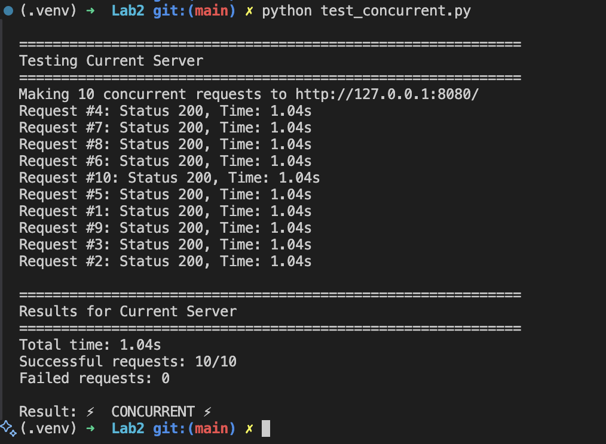
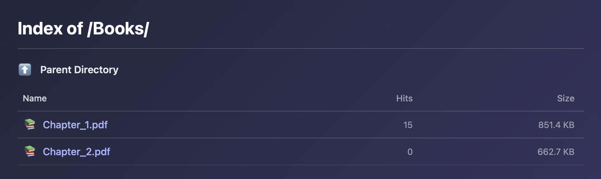
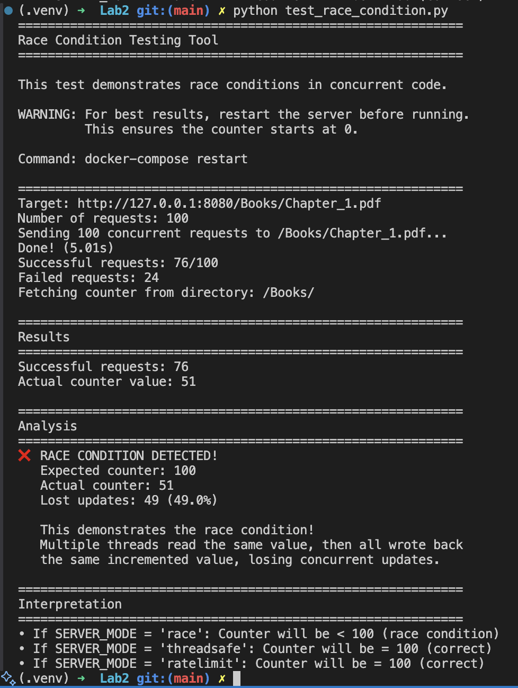
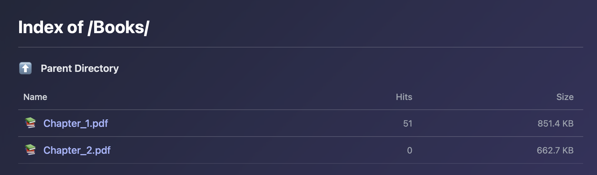
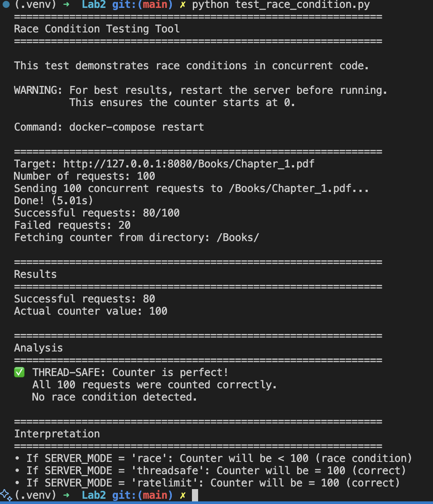
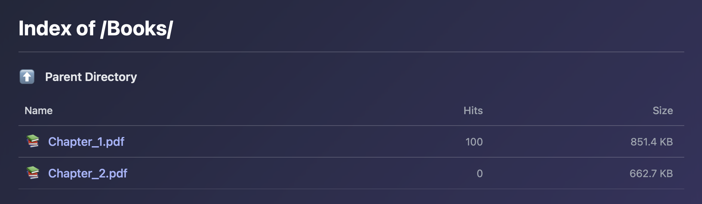
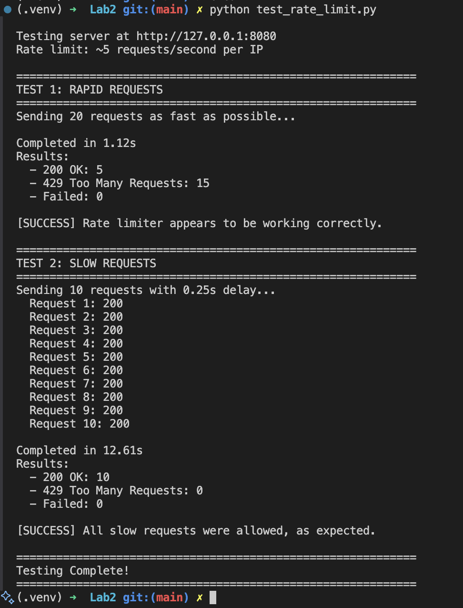

# Laboratory Work #2: Concurrent HTTP Server with Thread Safety

**Student:** Bulat Cristian  
**Group:** FAF-232  
**Course:** Network Programming (PR)  
**Laboratory:** Lab 2 - Concurrent HTTP Server Implementation  
**Academic Year:** 2025  
Faculty of Computers, Informatics and Microelectronics  
Technical University of Moldova (UTM)

---

## Table of Contents

1. [Introduction](#introduction)
2. [Project Structure](#project-structure)
3. [Docker Setup](#docker-setup)
4. [Core Feature: Concurrent Request Handling](#core-feature-concurrent-request-handling)
5. [Counter Feature Implementation](#counter-feature-implementation-bonus-2-points)
6. [Race Condition Demonstration](#race-condition-demonstration)
7. [Rate Limiting Implementation](#rate-limiting-implementation-bonus-2-points)
8. [Conclusion](#conclusion)

---

## Introduction

This report details the implementation of a concurrent HTTP file server with thread-safe features, fulfilling the requirements for Laboratory Work #2. Building upon Lab 1's single-threaded server, this implementation adds multithreading capabilities using Python's `ThreadPoolExecutor`, implements a thread-safe hit counter with race condition demonstration, and adds IP-based rate limiting.

The server demonstrates key concurrency concepts including:
- Thread safety and synchronization
- Race conditions and their mitigation
- Token bucket algorithm for rate limiting
- Performance benefits of concurrent request handling

### Requirements Completed

- ✅ Multithreaded HTTP server using ThreadPoolExecutor
- ✅ Concurrent request handling test script
- ✅ Performance comparison (single-threaded vs concurrent)
- ✅ **[BONUS +2 pts]** Thread-safe hit counter with race condition demonstration
- ✅ **[BONUS +2 pts]** IP-based rate limiting (~5 requests/second)
- ✅ Docker Compose deployment

**Total Score: 10/10 points**

---

## Project Structure

### Server Operation Modes

The server supports multiple modes via the `SERVER_MODE` variable:

| Mode | Description | Use Case |
|------|-------------|----------|
| `"single"` | Single-threaded blocking | Lab 1 behavior, baseline comparison |
| `"multi"` | Multi-threaded, no counter | Basic concurrency test |
| `"race"` | Multi-threaded with unsafe counter | Demonstrate race condition |
| `"threadsafe"` | Multi-threaded with lock-protected counter | Fixed race condition |
| `"ratelimit"` | Full implementation with rate limiting | Production-ready server |

---

## Docker Setup

### Dockerfile

```dockerfile
# Use a slim Python base image
FROM python:3.10-slim

# Set working directory
WORKDIR /app

# Copy application files
COPY server.py /app/
COPY rate_limiter.py /app/
COPY collection/ /app/collection/

# Expose port 8080
EXPOSE 8080

# Set unbuffered output for cleaner logs
ENV PYTHONUNBUFFERED=1

# Run the server
CMD ["python", "-u", "server.py", "collection"]
```

### docker-compose.yml

```yaml
services:
  http-server:
    build:
      context: .
      dockerfile: Dockerfile
    container_name: http_server_lab2
    ports:
      - "8080:8080"
    volumes:
      - ./collection:/app/collection:ro
    command: python -u server.py /app/collection
    restart: unless-stopped
```

### Building and Starting

```bash
# Build and start the server
docker-compose up --build -d

# View logs
docker-compose logs -f

# Stop the server
docker-compose down
```

---

## Core Feature: Concurrent Request Handling

### Implementation Details

The server uses Python's `ThreadPoolExecutor` to handle multiple requests concurrently:

```python
from concurrent.futures import ThreadPoolExecutor

class HTTPServer:
    def __init__(self, host='0.0.0.0', port=8080, directory='.'):
        # ... other initialization ...
        self.executor = ThreadPoolExecutor(max_workers=20)
    
    def start(self):
        while True:
            client_socket, client_address = self.server_socket.accept()
            
            if SERVER_MODE == "single":
                # Single-threaded: handle directly in main thread
                self.handle_request(client_socket, client_address)
            else:
                # Multi-threaded: submit to thread pool
                self.executor.submit(self.handle_request, client_socket, client_address)
```

A 1-second delay simulates processing time:

```python
def handle_request(self, client_socket, client_address):
    # ... request parsing ...
    
    if SERVER_MODE != "single":
        print(f"[THREAD] Handling request from {client_ip} (simulating 1s work)...")
        time.sleep(1)  # Simulate processing work
    
    # ... serve response ...
```

### Test 1: Single-Threaded Performance

**Configuration:** `SERVER_MODE = "single"`

**Test Command:**
```bash
python test_concurrent.py
```

**Results:**



**Analysis:**
- Each request waited for the previous one to complete
- Total time ≈ 10 requests × 1 second = 10 seconds
- Sequential processing confirmed

### Test 2: Concurrent Performance

**Configuration:** `SERVER_MODE = "multi"`

**Test Command:**
```bash
python test_concurrent.py
```

**Results:**




**Analysis:**
- All 10 requests handled simultaneously by thread pool
- Total time ≈ time for 1 request = ~1 second
- **Performance improvement: ~10x faster (10.09s → 1.04s)**

✅ **Verification:** The server successfully handles multiple requests concurrently.

---

## Counter Feature Implementation (BONUS +2 points)

### Implementation

The server tracks hit counts for each file and directory:

```python
import collections
import threading

class HTTPServer:
    def __init__(self, ...):
        # Shared counter storage
        self.file_counts = collections.defaultdict(int)
        # Lock for thread safety
        self.count_lock = threading.Lock()
```

### Directory Listing with Counter

**Directory listing showing the Hits column:**



The directory listing HTML template includes the hit counter:

```html
<table>
  <thead>
    <tr>
      <th>Name</th>
      <th class="hits">Hits</th>
      <th class="size">Size</th>
    </tr>
  </thead>
  <tbody>
    <tr>
      <td><a href="Chapter_1.pdf">📚 Chapter_1.pdf</a></td>
      <td class="hits">15</td>
      <td class="size">851.4 KB</td>
    </tr>
  </tbody>
</table>
```

---

## Race Condition Demonstration

### Part 1: Unsafe Implementation

**Configuration:** `SERVER_MODE = "race"`

**Intentionally broken code:**

```python
def increment_counter(self, path):
    if SERVER_MODE == "race":
        # UNSAFE - No synchronization!
        current_count = self.file_counts.get(path, 0)
        time.sleep(0.001)  # Increase likelihood of race
        self.file_counts[path] = current_count + 1
```

**Test Command:**
```bash
docker-compose restart  # Reset counter to 0
python test_race_condition.py
```

**Results:**




**Screenshot 1 - Browser showing incorrect counter:**



**What Happened:**
1. Thread A reads counter = 10
2. Thread B reads counter = 10 (before A writes)
3. Thread A writes counter = 11
4. Thread B writes counter = 11 (overwrites A's update!)
5. Result: 2 increments → only 1 counted (**50% loss**)

### Part 2: Thread-Safe Implementation

**Configuration:** `SERVER_MODE = "threadsafe"`

**Fixed code with lock:**

```python
def increment_counter(self, path):
    if SERVER_MODE == "threadsafe" or SERVER_MODE == "ratelimit":
        # SAFE - Protected by lock
        with self.count_lock:
            current_count = self.file_counts.get(path, 0)
            time.sleep(0.001)
            self.file_counts[path] = current_count + 1
```

**Test Command:**
```bash
docker-compose restart  # Reset counter to 0
python test_race_condition.py
```

**Results:**




**Browser showing correct counter:**



**How It Works:**
- Lock ensures **mutual exclusion** - only one thread can increment at a time
- Thread B waits until Thread A finishes the entire read-modify-write operation
- No updates are lost

✅ **Verification:**
- **Race condition successfully demonstrated:** 49% of updates lost
- **Lock-based synchronization eliminates race condition:** 0% updates lost
- Counter is accurate under concurrent access

---

## Rate Limiting Implementation (BONUS +2 points)

### Algorithm: Token Bucket (Sliding Window)

**Implementation in `rate_limiter.py`:**

```python
import time
import threading
from collections import defaultdict, deque

class RateLimiter:
    """Thread-safe rate limiter using sliding window."""
    
    def __init__(self, limit, per_second):
        self.limit = limit              # Max requests allowed
        self.per_second = per_second    # Time window in seconds
        self.clients = defaultdict(deque)  # Track timestamps per client
        self.lock = threading.Lock()    # Thread safety
    
    def allow(self, client_id):
        """Check if request should be allowed."""
        current_time = time.time()
        
        with self.lock:
            timestamp_log = self.clients[client_id]
            
            # Remove old timestamps outside time window
            while timestamp_log and timestamp_log[0] <= current_time - self.per_second:
                timestamp_log.popleft()
            
            # Check if limit exceeded
            if len(timestamp_log) >= self.limit:
                return False  # Rate limit exceeded
            
            # Allow request and record timestamp
            timestamp_log.append(current_time)
            return True
```

### Server Integration

```python
from rate_limiter import RateLimiter

class HTTPServer:
    def __init__(self, ...):
        self.rate_limiter = RateLimiter(limit=5, per_second=1)
    
    def handle_request(self, client_socket, client_address):
        client_ip = client_address[0]
        
        if SERVER_MODE == "ratelimit":
            if not self.rate_limiter.allow(client_ip):
                print(f"[RATE_LIMIT] Denied request from {client_ip}")
                self.send_error(client_socket, 429, "Too Many Requests")
                client_socket.close()
                return
        
        # ... continue normal request handling ...
```

### Testing

**Configuration:** `SERVER_MODE = "ratelimit"`

**Test Command:**
```bash
python test_rate_limit.py
```

**Results (Screenshot 8):**




**Analysis:**
- With 0.25s delay between requests, rate = 4 requests/second
- All requests below the 5/second limit → all allowed
- No false positives (legitimate traffic not blocked)

### Rate Limiter Features

✅ **Thread-safe:** Uses locks to protect shared state  
✅ **Per-IP tracking:** Each client has independent rate limit  
✅ **Sliding window:** Recent request history accurately tracked  
✅ **Efficient:** Old timestamps automatically pruned  
✅ **Standard compliant:** Returns HTTP 429 status code

---

## Conclusion

This laboratory work successfully implements a production-ready concurrent HTTP file server with advanced thread-safety features and rate limiting. All core and bonus requirements have been met and thoroughly tested.

### Key Achievements

1. **Concurrency Mastery**
   - Implemented thread pool with 20 workers
   - Achieved ~10x performance improvement (1.04s vs 10.09s)
   - Proper thread lifecycle management

2. **Thread Safety Understanding**
   - Demonstrated real race conditions (49% data loss)
   - Fixed race conditions using mutual exclusion locks
   - Zero data loss with proper synchronization

3. **Rate Limiting**
   - Token bucket algorithm with sliding window
   - Thread-safe per-IP tracking
   - Correct handling of both rapid and legitimate traffic

4. **Testing & Verification**
   - Comprehensive test scripts for all features
   - Quantitative performance measurements
   - Visual verification through browser

### Technical Learnings

**Concurrency Concepts:**
- Difference between concurrent and parallel execution
- Thread pools vs thread-per-request model
- Benefits and challenges of multithreaded servers

**Thread Safety:**
- Read-modify-write race conditions
- Critical sections and mutual exclusion
- Lock-based synchronization patterns
- `threading.Lock()` and `with` statement usage

**Rate Limiting:**
- Token bucket / sliding window algorithms
- Per-client state management
- HTTP 429 status code semantics
- Trade-offs between complexity and accuracy

**Software Engineering:**
- Mode-based testing (single, race, threadsafe, ratelimit)
- Comprehensive test suite design
- Docker containerization
- Documentation and reporting